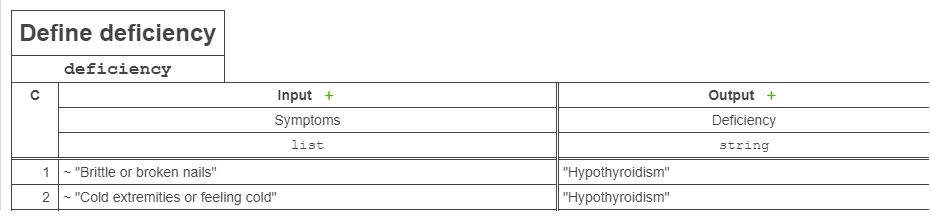

# ART-DMN-FEEL-PLUGIN

ART-DMN-FEEL-PLUGIN is an extension for [Camunda FEEL plugin] that makes it easier to use the command `list contains()` from
[Camunda FEEL plugin] adding symbol `~` as an alias for the command.

## Installation

To enable this extension in your project you have to register both [Camunda FEEL plugin] and ART-DMN-FEEL-PLUGIN. The following steps
describe these actions in detail:

1. Install this plugin into your local mvn repo 
    ```
    git clone https://github.com/Artezio/ART-DMN-FEEL-PLUGIN.git
    cd ART-DMN-FEEL-PLUGIN
    mvn install
    ```
2. Add the plugin to your project as a mvn dependency
    ```xml
    <dependency>
        <groupId>com.artezio.bpm.camunda</groupId>
        <artifactId>camunda-dmn-feel-extension-plugin</artifactId>
        <version>1.0</version>
    </dependency>
    ```
3. Register plugins:
    
    For `process.xml`
    ```xml
    <process-engine name="...">
        ...
        <plugins>
            ...
            <plugin>
                <class>org.camunda.feel.CamundaFeelEnginePlugin</class>
            </plugin>
            <plugin>
                <class>com.artezio.camunda.plugin.FeelExtensionPlugin</class>
            </plugin>
        </plugins>
    </process-engine>
    ```
    
    For `camunda.cfg.xml`
    ```xml
    <bean id="processEngineConfiguration">
       ...
       <property name="processEnginePlugins">
           <list>
               ...
               <ref bean="camundaFeelEnginePlugin"/>
               <ref bean="feelExtensionPlugin"/>
           </list>
       </property>
    </bean>
    
    ...
    
    <bean id="camundaFeelEnginePlugin" class="org.camunda.feel.CamundaFeelEnginePlugin"/>
    <bean id="feelExtensionPlugin" class="com.artezio.camunda.plugin.FeelExtensionPlugin"/>
    ```

## Usage

While creating a dmn table select `list` as an input type and add values to the table preceded by the symbol `~`.<br/>
Example:<br/>


[Camunda FEEL plugin]: https://github.com/camunda/feel-scala/tree/master/feel-engine-plugin
[Camunda Modeler]: https://camunda.com/download/modeler/